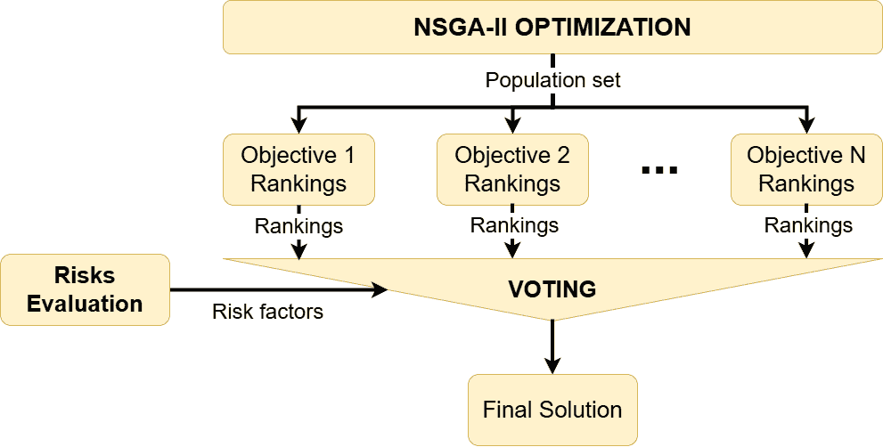

# ARENA

ARENA is an adaptive risk-aware and energy-efficient navigation approach used in multi-objectives path planning problem in complex 3D environments. This algorithm enables online trajectory adaptation by optimizing multiple objectives on a Pareto front with a genetic-based algorithm and using non-uniform rational b-spline as a continuous representation of trajectories. A novel risk-aware voting algorithm ensures adaptivity by choosing one solution of the optimization according to evolving mission risks.

If you find this work useful or interesting, we kindly invite you to star :star: the library!

Authors:
[David-Alexandre Poissant](https://scholar.google.com/citations?hl=fr&user=Svw24awAAAAJ),
[Louis Petit](https://scholar.google.com/citations?hl=fr&user=hRBrqKIAAAAJ).

<p align="center"><strong>ARENA demo with the linedrone problem</strong></p>
<p align = "center">

</p>
<p align="center"><strong>*Keep in mind that this is a slowed representation of the optimization process as we show all solution sets throughout optimization.</strong></p>
<p align="center"><strong>Hyperparameters for this demo</strong></p>

<div align="center">
<table>
  <thead>
    <tr><th>Hyperparameter name</th><th>Value</th><th>Unit</th></tr>
  </thead>
  <tbody>
    <tr> <td>NSGA-II number of generation</td><td>2500</td><td>n/a</td></tr>
    <tr><td>NSGA-II population size</td><td>100</td><td>n/a</td></tr>
    <tr><td>OMPL RRT node distance (initialization)</td> <td>9.0</td><td>m</td></tr>
    <tr><td>NURBS sampling size</td><td>50</td><td>n/a</td></tr>
  </tbody>
</table>
</div>

These hyperparameters have been chosen only to show optimization process and are way over-designed for the linedrone problem.

### *Note
As of now, the algorithm has been only applied to real UAV power line inspection scenarios. We plan to investigate the generalization of the method to different scenarios and different platforms in future works. This algorithm represents a framework of multi-objective optimisation in the field of path planning or decision making for unmanned autonomous robots. As of now, we can optimize, but are not limited to, time, safety, and energy along a trajectory for an inspection UAV.

## Related paper
<a href="https://arxiv.org/abs/2502.19401" style="vertical-align:middle; display:inline;">
    
</a>

*ARENA: Adaptive Risk-aware and Energy-efficient NAvigation for Multi-Objective 3D Infrastructure Inspection with a UAV*, David-Alexandre Poissant, Alexis Lussier Desbiens, François Ferland, and Louis Petit (To be submitted to ICRA2026). 

<p align="center"><strong>Real flights in a simulated power line inspection scenario</strong></p>
<p align = "center">


</p>

In the UAV power line inspection scenario, we optimize for time, safety, and energy. We can see trajectories in green staying further from obstacles, trajectories in pink being faster and more energy-efficient, and trajectories in white being a mix of every objective.

<p align="center"><strong>Pareto front visualization after optimization</strong></p>
<p align = "center">

</p>

After the genetic-based optimization, the ARENA framework proposes a Pareto front of optimized trajectories answering different multiple situations.

<p align="center"><strong>Trajectories according to different sets of mission risks for an inspection UAV</strong></p>
<p align = "center">


</p>

Our voting algorithm is adapted for any amount of objectives, as long as a factor for each one comes from evolving mission risks. You can also fix objective weight as a design intent.

<p align="center"><strong>Voting algorithm schematic</strong></p>
<p align = "center">

</p>


## Acknowledgements
* This work extends [MOAR-Planner](https://github.com/SAFiRLab/moar-planner) to 3D environments and optimizes all path planning objectives as a Pareto front.


## Hardware setup
We run the docker image on windows 11 integrating WSL2 through Docker. Architecture: x64

### *Note
We realize that the image docker image is based on an nvidia/cuda image, but it is not a hardware requirement for now.

## Quick start
This library was primarly developped using docker. Therefore, for easy quick start to test the library, we suggest installing [docker](https://www.docker.com/products/docker-desktop/).

Taking for granted an up-to-date version of docker has been installed and docker engine with WSL2 integration is running:

1. Build the container image using OS specified script in [scripts](./scripts) (this can take awhile)
2. Run the container image using OS specified script in [scripts](./scripts)
3. In the container: ```colcon build --cmake-args -DCMAKE_BUILD_TYPE=Release -DENABLE_ROS2```

We recommend using [VSCode](https://code.visualstudio.com/) with the dev container for remote explorer [extension](https://code.visualstudio.com/docs/remote/remote-overview) since you can easily launch multiple terminals and therefore launch multiple ROS2 nodes at the same time.

4. In the container: ```ros2 launch arena_core costmap_3D_node```
5. In the container (another terminal): ```ros2 launch arena_core linedrone_test_node```
6. In the container (another terminal) send planning request informations:

```
ros2 topic pub /linedrone_test_node/planning_activation std_msgs/msg/Bool "data: true" --once
ros2 topic pub /linedrone_test_node/goal_pose geometry_msgs/msg/PointStamped "{
  header: {
    frame_id: 'map'
  },
  point: {
    x: 59.367,
    y: -26.573,
    z: 44.997
  }
}" --once
```

Note that these are examples start-goal positions!

We also note that we use [Foxglove](https://foxglove.dev/download) to visualize ros2 data with our linedrone demo. This container image already comes with foxglove bridge so if you want to be able to visualize in foxglove run:

7. In the container: ```ros2 run foxglove_bridge foxglove_bridge```


## Manual setup environment

To build your dev environment you can follow the steps in the [Dockerfile](./Dockerfile), but here is a detailed breakdown of the needed steps. Note that for clarity and simplicity we give command lines for ubuntu-based OS, but the steps stays the same.

### Dependencies

1. **ROS2 Facultative** If you want to run the linedrone demo or run the costmap node, you need a ROS2 distribution.
2. **ROS2 Facultative** Create your ROS2 workspace.
3. **ROS2 Facultative** install linedrone demo and costmap_node dependencies (replace DISTRO variable with your ROS2 distribution ex: humble):

```
DISTRO=humble
apt-get update && apt-get install -y \
    ros-${DISTRO}-ompl \
    ros-${DISTRO}-octomap \
    ros-${DISTRO}-octomap-ros \
    ros-${DISTRO}-octomap-server \
    libjsoncpp-dev \
    libsecret-1-dev \
    libccd-dev && \
    libpcl-dev  && \
    rm -rf /var/lib/apt/lists/*
```

The arena_core library has 7 required dependancies: [Eigen3](https://eigen.tuxfamily.org/index.php?title=Main_Page), [OMPL](https://ompl.kavrakilab.org/), [pagmo2](https://esa.github.io/pagmo2/), and [octomap](https://octomap.github.io/), [PCL](https://pointclouds.org/), [Boost](https://www.boost.org/), and [cmake](https://cmake.org/), **ROS2 FACULTATIVE** and 1 dependency if you want to run the linedrone demo or the costmap node: yaml-cpp. Also, ROS2 packages uses [ament-cmake](https://docs.ros.org/en/foxy/How-To-Guides/Ament-CMake-Documentation.html).

4. **ROS2 Facultative** If you want to run the linedrone demo or the costmap_node, you will need all external dependancies and ROS2 so you should have done steps 1 through 4 and therefore OMPL, Octomap, Eigen3, PCL, yaml-cpp, boost, and ament cmake should already be installed.

5. **If you don't need to run ROS2 demos** (steps 1 through 5), here's how to install boost, ament cmake, and pcl:

```
sudo apt install cmake, libboost-all-dev, libpcl-dev
```

6. **If you don't need to run ROS2 demos** (steps 1 through 5), here's how to install Eigen3:

```
sudo apt install libeigen3-dev
```

7. **If you don't need to run ROS2 demos** (steps 1 through 5), you can follow [this documentation](https://ompl.kavrakilab.org/installation.html) to install OMPL from sources.

8. For pagmo2, we have a temporary fork to fix some bugs and add small features in order to check initial population boundaries and give the possibility to change the initial population. **We have no intent of distributing this fork to respect their GPL-3.0 licence** (Note that we implement the fixes and features [here](https://github.com/Dave-Poissant/pagmo2/tree/work_on_archipelago) and you are free to change the git clone link). Here is how to install it from sources:

```
cd ~
git clone https://github.com/esa/pagmo2.git
# If you are cloning our fork checkout the work_on_archipelago branch:
# git checkout -b work_on_archipelago origin/work_on_archipelago
git fetch
git pull
cd ~/pagmo2
mkdir build
cd build
cmake .. -DPAGMO_WITH_EIGEN3=ON -DCMAKE_BUILD_TYPE=Release
cmake --build .
sudo cmake --build . --target install
```

9. **If you don't need to run ROS2 demos** (steps 1 through 5), you can follow [this documentation](https://github.com/OctoMap/octomap/wiki/Compilation-and-Installation-of-OctoMap) to install Octomap from sources.

### Build arena_core

1. Clone the ARENA repository and **ROS2 Facultative** place the arena_core package in your worskpace/src.

2. Move into the arena_core folder

3. ```
   mkdir build
   cd build
   # Change <PATH_TO_ARENA_CORE_ROOT_FOLDER> with the path to arena_core
   cmake <PATH_TO_ARENA_CORE_ROOT_FOLDER> -DCMAKE_BUILD_TYPE=Release -DENABLE_ROS2=OFF
   make
   sudo make install
   ```

4. You can test the build with:

```
# Change <PATH_TO_ARENA_CORE_ROOT_FOLDER> with the path to arena_core
cd <PATH_TO_ARENA_CORE_ROOT_FOLDER>
./build/libs/demos/tests/pagmo_test
```


## Code usage for different optimization problems

We give a full explanation of how to use the library's APIs [here](./arena_core/libs/README.md)


## Licence
The source code is released under the [BSD 3-Clause](https://opensource.org/license/bsd-3-clause) licence.

## Maintenance
We are still working on extending the proposed framework and improving code reliability and optimization.

If you are using this library and would like your project to be included in our list of featured projects, feel free to contact us, we’ll be happy to add it.

For any inquiries, please contact the authors through this [google form](https://docs.google.com/forms/d/e/1FAIpQLSfq_Xg0x-n_8Bg8ee6tKegsIJoKrA4ExM2agFWxi_-rJXfBAw/viewform?usp=sharing&ouid=110205931671074698596)

