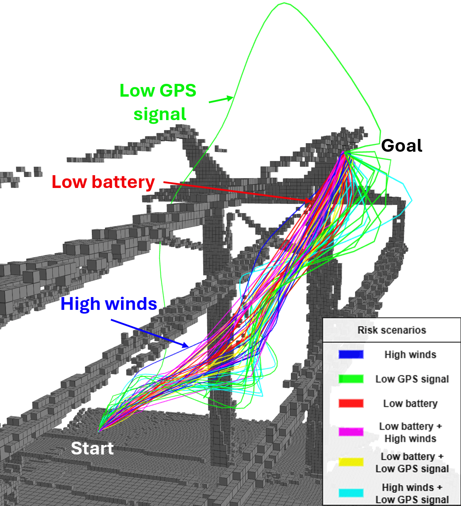

# ARENA

ARENA is an adaptive risk-aware and energy-efficient navigation approach used in multi-objectives path planning problem in complex 3D environments. This algorithm enables online trajectory adaptation by optimizing multiple objectives on a Pareto front with a genetic-based algorithm and using non-uniform rational b-spline as a continuous representation of trajectories. A novel risk-aware voting algorithm ensures adaptivity by choosing one solution of the optimization according to evolving mission risks.

### *Note
As of now, the algorithm has been only applied to real UAV power line inspection scenarios. We plan to investigate the generalization of the method to different scenarios and different platforms. This algorithm represents a framework of multi-objective optimisation in the field of path planning or decision making for unmanned autonomous robots. As of now, we can, but are not limited, to optimize time, safety, and energy along a trajectory for an inspection UAV.

## Related paper
*ARENA: Adaptive Risk-aware and Energy-efficient NAvigation for Multi-Objective 3D Infrastructure Inspection with a UAV*, David-Alexandre Poissant, Alexis Lussier Desbiens, François Ferland, and Louis Petit (To be submitted to ICRA2026). 

<strong>Real flights in a simulated power line inspection scenario</strong>

In the UAV power line inspection scenario, we optimize for time, safety, and energy. We can see trajectoris in green staying further from obstacles, trajectories in pink being faster and more energy-efficient, and trajectories in white being a mix of every objective.

<strong>Pareto front visualization after optimization</strong>

After the genetic-based optimization, the ARENA framework proposes a Pareto front of optimized trajectories answering different multiple situations.

<strong>Trajectories according to different sets of mission risks for an inspection UAV</strong>

## Acknowledgements
* This work extends [MOAR-Planner](https://github.com/SAFiRLab/moar-planner) to 3D environments and optimizes all path planning objectives as a Pareto front.
