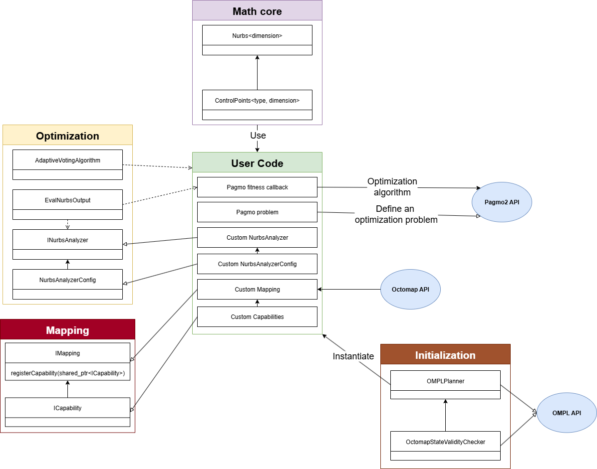

# Code Usage

The class ownership diagram above shows the relationship between the classes in ARENA and its dependencies. For example, **Nurbs** are defined using **ControlPoints** and their dimensions must be the same. The **INurbsAnalyzer** doesn't own **EvalNurbsOutput** but uses one in its argument to fill the evaluation output. 

### To use ARENA, users must implement:

1. Custom **NurbsAnalyzer** (this is how you will evaluate every trajectories).

Here is an [example](https://github.com/SAFiRLab/ARENA/blob/main/arena_core/demos/include/linedrone/linedrone_nurbs_analyzer.h#L170) of a custom NurbsAnalyzer.

2. Custom **NurbsAnalyzerConfig** (this contains essential informations to evaluate constraint and potentially cost functions).

Here is an [example](https://github.com/SAFiRLab/ARENA/blob/main/arena_core/demos/include/linedrone/linedrone_nurbs_analyzer.h#L58) of a custom NurbsAnalyzerConfig for the Linedrone demo.

3. Implement a **pagmo problem** (this is where the optimization problem is defined. How many cost functions, constraints, number of variables, and bounds).

Here is an [example](https://github.com/SAFiRLab/ARENA/blob/main/arena_core/demos/include/linedrone/linedrone_problem.hpp) of a pagmo problem for the Linedrone demo.

4. A **pagmo fitness callback** (this is what will be called by the optimization algorithm that you selected from pagmo2. This is where you'll call your custom **NurbsAnalyzer** and use the **EvalNurbsOutput** to fill the pagmo2's fitness vector)

Here is an [example](https://github.com/SAFiRLab/ARENA/blob/main/arena_core/demos/nodes/linedrone_test_node.cpp#L704) how a pagmo fitness callback from the Linedrone demo.

### To use ARENA, users are recommended but not obligated to instantiate:

1. The **OMPLPlanner** (that is a OMPL::SimpleSetup wrapper where we simplify the OMPL planning setup. Users must choose a OMPL::StateValidityChecker, a planner, and an objective to give to the planner. In the Linedrone demo, we use the OMPLPlanner to initialize our initial NSGA-II population with multiple outputs of an RRT algorithm.)

Here is an [example](https://github.com/SAFiRLab/ARENA/blob/main/arena_core/demos/nodes/linedrone_test_node.cpp#L975) of how you instantiate the OMPLPlanner adequatly.

2. The **Costmap3D** (that is where the main Octree and ColorOctree are updated and maintained. We inflate the base octree with your platform's dimensions and then create a new Octree. We also create a ColorOctree using platform dimensions and min/max obstacle influence, which defines a Signed Distance Field (SDF) to use in safety-like cost functions as in the Linedrone demo.)

Here is an [example](https://github.com/SAFiRLab/ARENA/blob/main/arena_core/demos/nodes/costmap_3D_node.cpp) of how to use the Costmap3D. Note that this is in a separate process because we choose to map in parrallel of planning.
